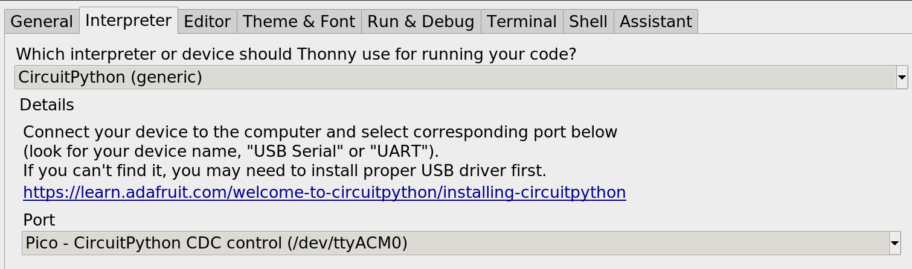
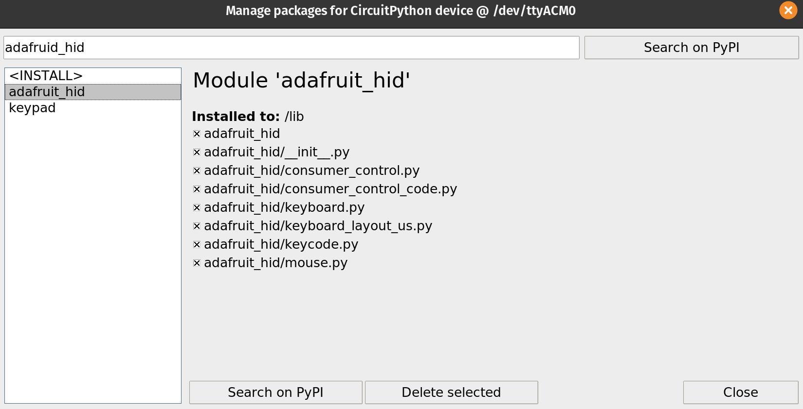

This is in old idea.

I first thought of it when I tried to use VI.

My finger was hurting from pressing Ctrl so often.

And I thought: - If we use our feet to make driving more efficient, why not the pc?

Well, here is your chance


# Requirements
- 1 Raspberry PI pico (4 usd)
- 1 USB cable
- 2 resistors (to be honest I still don't understand why this)
- 2 cheap pedals. (~6 euros in dx.com)

Assembling this is quite simple.

If you can't do it, I am sure a friend would do this for you in no time.

# setting up the development environment

## Step 1: set up raspberry pi pico
Follow the guide [here](https://datasheets.raspberrypi.com/pico/raspberry-pi-pico-python-sdk.pdf)
once you have micropython working, and manage to access your pi, move over to step 2

## Step 2: install Thonny
important: do not install snap or flatpack. I tried both and they don't work!
follow this guide [here](https://github.com/thonny/thonny/wiki/Linux)

## Step 3: Installing CircuitPython
download the UF2 file [here](https://circuitpython.org/board/raspberry_pi_pico/)

## Step 4: libraries
start thonny, click on the botton right button to change the python, select CircuitPython(generic), and the port witt your pico


then click on tools / manage packages.... / search for adafruid_hid and install it


all set, 
happy coding :sunglasses: :+1: 

# the code:

This is a sample of the embedded app:
thank you Idris for [the code](https://tutorial.cytron.io/2021/02/16/keyboard-emulator-using-raspberry-pi-pico-maker-pi-pico-and-circuitpython/) post

```python
import time

import board
import digitalio
import usb_hid
from adafruit_hid.keyboard import Keyboard
from adafruit_hid.keyboard_layout_us import KeyboardLayoutUS
from adafruit_hid.keycode import Keycode

keypress_pins = [board.GP13, board.GP14, board.GP15]
key_pin_array = []
keys_pressed = [Keycode.LEFT_ARROW, Keycode.RIGHT_ARROW, Keycode.SPACEBAR]
control_key = Keycode.SHIFT

time.sleep(1)  # Sleep for a bit to avoid a race condition on some systems
keyboard = Keyboard(usb_hid.devices)
keyboard_layout = KeyboardLayoutUS(keyboard)

# Make all pin objects inputs with pullups
for pin in keypress_pins:
    key_pin = digitalio.DigitalInOut(pin)
    key_pin.direction = digitalio.Direction.INPUT
    key_pin.pull = digitalio.Pull.UP
    key_pin_array.append(key_pin)

led = digitalio.DigitalInOut(board.GP25)
led.direction = digitalio.Direction.OUTPUT

print("Waiting for key pin...")

while True:
    for key_pin in key_pin_array:
        if not key_pin.value:  # Is it grounded?
            i = key_pin_array.index(key_pin)
            print("Pin #{} is grounded.".format(i))

            led.value = True

            while not key_pin.value:
                pass  # Wait for it to be ungrounded, to print on key up


            # "Type" the Keycode or string
            key = keys_pressed[i]  # Get the corresponding Keycode or string
            if isinstance(key, str):  # If it's a string...
                keyboard_layout.write(key)  # ...Print the string
            else:  # If it's not a string...
                keyboard.press(control_key, key)  # "Press"...
                keyboard.release_all()  # ..."Release"!

            led.value = False

    time.sleep(0.01)
```

# Run it!

If you are using Thonny, all you have to do is to click on run.

Now every time you press you pedal, you will get key press events on your computer.

In this code, I configured arrow left, arrow right and spacebar.

My code is part of the tabber project @ [github.com/tiagodll/tabber/tree/master/src/pedal](https://github.com/tiagodll/tabber/tree/master/src/pedal)

Now that you have the hardware done, software uploaded and a bit of time to spare, grab your bass guitar and go have a try at [tabber.dalligna.com](https://tabber.dalligna.com)

:wink: